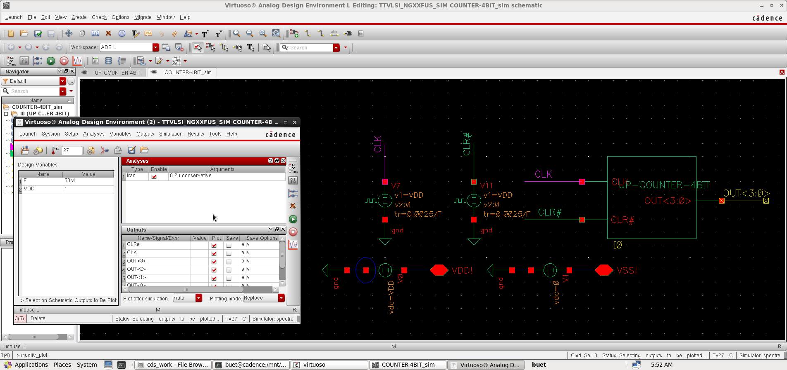

# vlsi_lab
## Newest - upcounter-4bit:
### Schematic


### Simulation

#### Simulation / Schematic


#### Simulation / Set-up



#### Simulation / Result


# Prepair for Final Project
#z# Boolean Function Simplification using Karnaugh Map

### Problem Statement

Given the Boolean function:

```
F(D, C, B, A) = Σ(0, 1, 4, 5, 7, 10, 14, 15) + d(2, 8, 11, 13)
```
Noted that:
    - Σ : Sum
    - d : Don't care (symbol: X)

---

### a. Truth Table

| D | C | B | A | Decimal | F  |
|:-:|:-:|:-:|:-:|:-------:|:--:|
| 0 | 0 | 0 | 0 |   0     | 1  |
| 0 | 0 | 0 | 1 |   1     | 1  |
| 0 | 0 | 1 | 1 |   3     | 0  |
| 0 | 0 | 1 | 0 |   2     | X  |
| 0 | 1 | 0 | 0 |   4     | 1  |
| 0 | 1 | 0 | 1 |   5     | 1  |
| 0 | 1 | 1 | 1 |   7     | 1  |
| 0 | 1 | 1 | 0 |   6     | 0  |
| 1 | 1 | 0 | 0 |  12     | 0  |
| 1 | 1 | 0 | 1 |  13     | X  |
| 1 | 1 | 1 | 1 |  15     | 1  |
| 1 | 1 | 1 | 0 |  14     | 1  |
| 1 | 0 | 0 | 0 |   8     | X  |
| 1 | 0 | 0 | 1 |   9     | 0  |
| 1 | 0 | 1 | 1 |  11     | X  |
| 1 | 0 | 1 | 0 |  10     | 1  |

---

### b. Karnaugh Map (4-Variable)


| DC / BA |  00  |  01  |  11  |  10  |
|  :--:   | :--: | :--: | :--: | :--: |
|  00     |  1   |  1   |  0   |  X   |
|  01     |  1   |  1   |  1   |  0   |
|  11     |  0   |  X   |  1   |  1   |
|  10     |  X   |  0   |  X   |  1   |


---

### ✅ Final Simplified Boolean Expression

```
F(D, C, B, A) = BD + B'.D' + A.C
```

---

### Notes
- Minterms (Σ) are the input combinations where F = 1.
- Don't cares (X) can be used in Karnaugh map grouping to simplify the function.
- K-map grouping helps reduce the logic into its minimal form.
